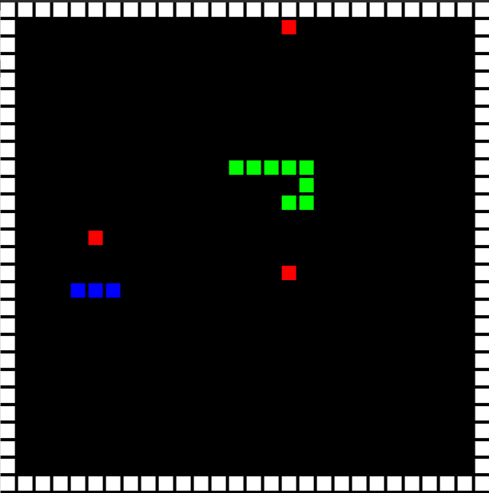

# slitherin-gym
Slither-in Inspired Snake Environment for OpenAI Gym (Part of Requests for Research 2.0)

## Environment Description

* `observation_space` - A tuple of size: `(n_agents, resolution, resolution)`, where `n_agents` is the number of agents in the game (as initialized) and `resolution` is a number calculated by taking the screen's height and dividing it by the spacing, both of which can be specified in the environment's constructor.
* `action_space` - A `n_agents`-sized array that takes in 4 discrete actions `[0, 1, 2, 3]`, which corresponds to the directions that each agent should move at the next timestep. 

The agents and environment abide by the same rules and dynamics of the classic Snake game (i.e can't go backwards, die if they hit themselves, etc.). A more detailed description can be found [here](https://blog.openai.com/requests-for-research-2/). 

Each observation per agent is a matrix that corresponds to the agent's place in the grid.

* If the agent is dead, each square fills up with a -1.
* If the agent is occupying that cell, the value of that cell will be 1.
* If another agent is occupying that cell, the value of that cell will be 2.
* Likewise, a fruit will be 3.
* A wall (which surrounds the outside of the grid, and is lethal to any agent who touches it) will have a value of -1.
* Any empty or non-occupied cell will take the value of 0.

